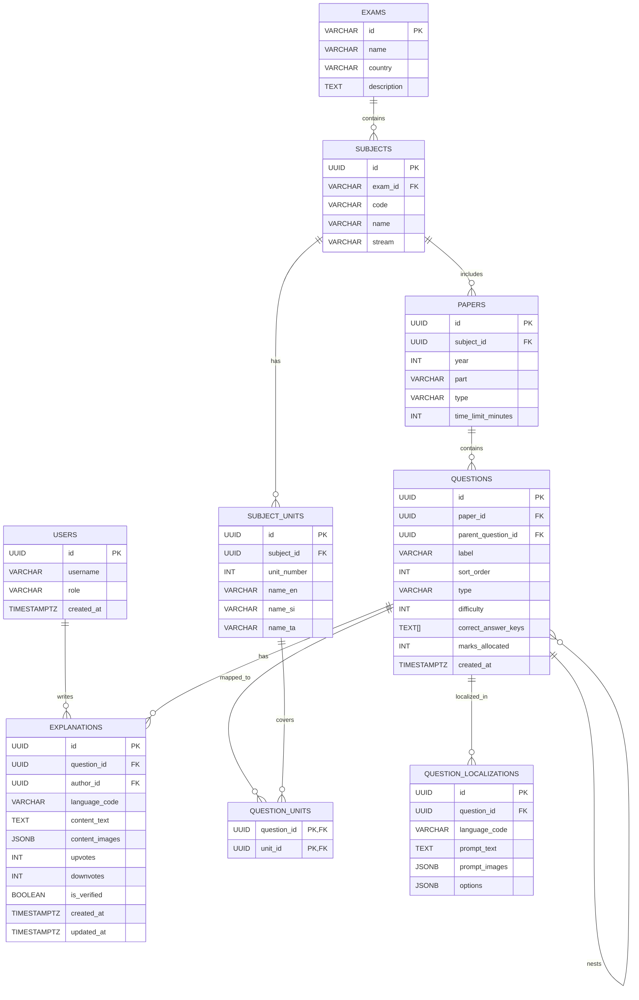

# OpenPapers Data Collecting

OpenPapers Data Collecting is a repository for organizing and curating academic exam data, question content, and community explanations. The project combines a FastAPI backend with a Next.js frontend to support collection, review, and presentation of exam paper metadata and localized question content.

## Overview

This project is designed around a structured exam data model for educational content, especially for Sri Lankan national exam papers. It supports:

- Exam and subject metadata
- Subject units and paper definitions
- Question trees and nested sub-questions
- Localized prompts and MCQ options in English, Sinhala, and Tamil
- Community explanations submitted by users
- Moderation flags for verified explanations

## Repository Structure

```text
openpapers-data-collecting/
├── schema.sql
├── Extractor/
│   ├── backend/
│   │   ├── main.py
│   │   ├── routers/
│   │   │   ├── pdf_router.py
│   │   │   └── vast_router.py
│   │   └── services/
│   │       ├── pdf_service.py
│   │       └── vast_service.py
│   └── frontend/
│       ├── app/
│       ├── components/
│       ├── store/
│       ├── package.json
│       ├── README.md
│       └── ...
└── README.md
```

## Tech Stack

- Backend: FastAPI
- Frontend: Next.js + React + TypeScript
- Database: PostgreSQL
- Schema definition: SQL with Postgres-native features such as UUIDs, JSONB, and arrays

## Core Data Model

The schema is built around a simplified exam taxonomy and question content model.

### 1. Users

Users are represented minimally and can later be extended with roles such as USER, MODERATOR, and ADMIN.

### 2. Exams, Subjects, Units, and Papers

The schema supports exam-level metadata and organizes content as:

- Exam
- Subject
- Subject unit
- Paper

### 3. Questions and Nested Structure

Questions are modeled as a hierarchical tree structure using a self-referencing `parent_question_id` in the `questions` table, enabling nesting for subquestions and grouped prompts.

### 4. Localized Content

Question content is stored in `question_localizations`, supporting three languages:

- `en`
- `si`
- `ta`

This allows localized prompt text and MCQ options to be served per language.

### 5. Community Explanations

Users can add explanations tied to a question, with support for content text, images, votes, and verification by a moderator or teacher.

## ER Diagram



## Database Notes

The schema uses PostgreSQL features intentionally:

- `UUID` for globally unique identifiers
- `JSONB` for flexible multilingual content and image metadata
- `TEXT[]` for multiple correct answer keys
- `UNIQUE` constraints to maintain stable academic mappings
- indexes on commonly queried relationships such as paper, parent question, and localization lookups

## Suggested Next Steps

- Define API routes for creating and retrieving exam metadata
- Build CRUD endpoints for questions and localized content
- Add moderation workflow for explanation verification
- Connect frontend forms to the database-backed backend
- Add validation and import scripts for exam paper ingestion

## License

This repository does not currently include a project-specific license file. If you plan to publish or share the project publicly, consider adding an appropriate license such as MIT or Apache-2.0.
